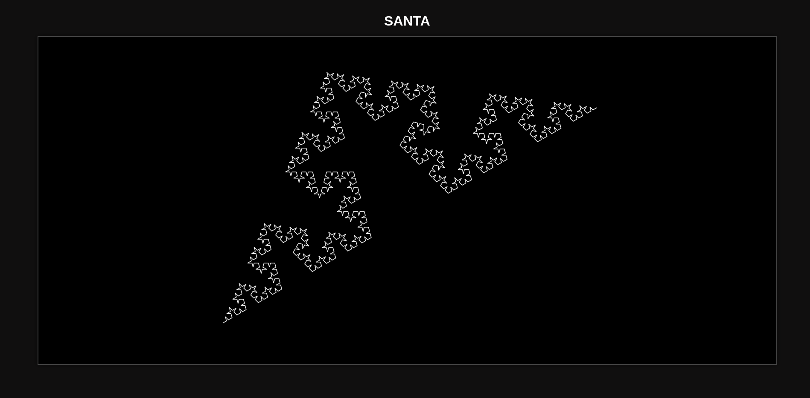

# PROGRAMMING ASSIGNMENT 1: REPORT
## Author: Shreyas Mehta (2023101059)
## INDEX
1. [Question 1: Frequency of States in a Deterministic Finite Automaton (DFA)](#question-1-frequency-of-states-in-a-deterministic-finite-automaton-dfa)
2. [Question 2: Generative L-Systems Visualization](#question-2)
    - [PART A: Mirror Ball](#part-a-mirror-ball)
    - [PART B: L-System Tree](#part-b-l-system-tree)
    - [PART C: Generative L-System Trees with Probability](#part-c-generative-l-system-trees-with-probability)
    - [Noise L-System Visualization](#noise-l-system-visualization)
3. [Question 3: Given LSystems: Find the AXIOMs](#question-3-given-lsystems-find-the-axioms)
    - [Part A: Stick plant system](#part-a-stick-plant-system)
    - [Part B: Santa](#part-b-santa)
    - [JSON Format Answer](#json-format-answer)

### Directory Structure
```
.
├── q1
│   └── prng.py
├── q2
│   ├── images
│   │   ├── anything.png
|   |   ├── tree.png
│   │   ├── mirrorball.png
│   │   └── noise.png
|   ├── anything.html
│   ├── anything.js
|   ├── mirrorball.html
│   ├── mirrorball.js
│   ├── noise.html
│   ├── noise.js
│   ├── tree.html
│   └── tree.js
└── q3
    ├── CodeAndImage
    |   ├── santa.html
    │   ├── santa.png
    │   ├── santa1.png
    │   ├── stick_plant.html
    │   ├── stick_plant.png
    │   └── stick_plant1.png
    ├── santa.json
    └── stick_plant.json
```

### Question 1: Frequency of States in a Deterministic Finite Automaton (DFA)

#### Objective:
Given a DFA (Deterministic Finite Automaton), we are tasked with finding the frequency of states visited by a Pseudo-Random Number Generator (PRNG) starting from a given initial state. The problem involves computing how frequently the PRNG outputs certain states based on a number of transitions between the DFA states.

#### Input Format:
1. **T** - the number of test cases.
2. For each test case:
   - **N, M, S, X**: 
     - **N**: the number of states in the DFA.
     - **M**: the number of relevant transitions.
     - **S**: the starting state of the DFA.
     - **X**: the number of PRNG outputs to consider.
   - **M lines** follow, each containing two integers **a** and **b**, representing that the DFA transitions from state **a** to state **b**.

#### Output Format:
For each test case, output **N** space-separated integers where the i-th integer represents the frequency of the state **i** being output by the PRNG.

#### Approach:
`Pumping Lemma` is used to solve the problem. The approach involves two key steps:
1. **Cycle Detection**: The problem's key is to detect cycles in the transitions and compute how many times the cycle is repeated given the number of outputs.
2. **Initial and Cycle Phase**: The approach splits the traversal into two phases:
   - **Initial Phase**: Traversing the DFA before entering any cycle.
   - **Cycle Phase**: When a cycle is detected, the states in the cycle repeat periodically.

#### Functions:
- **`takeInput()`**: Handles reading input for each test case.
- **`getCycle()`**: Detects the cycle starting from a given state.
- **`getInitial()`**: Determines the initial states visited before entering the cycle.
- **`compute()`**: Coordinates the process of finding cycles, initial transitions, and calculating the frequencies of states.
- **`output()`**: Computes the frequency of states visited using the initial and cycle phases.
- **`printOutput()`**: Outputs the frequency array for each test case.

#### Complexity:
- **Time Complexity**: O(N + M) for each test case, where:
  - N is the number of states.
  - M is the number of transitions.
#### Space Complexity:
- **Space Complexity**: O(N) for each test case, where N is the number of states.
#### How to Run:

1. Run the script:
   ```bash
   python3 prng.py
   ```
2. Provide input in the specified format.

#### Example:
##### Input:
```
1
5 4 1 10
1 2
2 3
3 4
4 1
```
##### Output:
```
3 3 2 2 0 
```

#### Explanation:
- The DFA has 5 states and 4 transitions.
- The PRNG starts at state 1 and generates 10 outputs.
- The cycle is detected from state 1 to 4 and back to 1.
- The initial phase traverses states 1, 2, and 3.
- The cycle phase repeats states 1 and 2.
- The frequency of states visited is [3, 3, 2, 2, 0].

---
---
### Question 2:
### PART A: Mirror Ball
#### FILES:
- `mirrorball.html`
    - The HTML file contains a simple webpage with a mirror ball  implemented using Lindenmayer Systems (L-Systems) with canvas.
- `mirrorball.js`
    - The JavaScript file contains the logic for generating the mirror ball using L-Systems.
- `mirrorball.png`
    - The image file contains the output of the mirror ball generated by the code.


#### L-System Configuration

The L-System in this code generates a fractal pattern using recursive rules. The system consists of the following components:
- **Axiom**: The starting string or "seed" of the system, which is `"G"`. This is the initial state of the system before applying any rules.
  
- **Production Rules**:
  - `G → X-G-X`: When the system encounters `G`, it replaces it with `X-G-X`.
  - `X → G+Y+G`: When it finds `X`, it replaces it with `G+Y+G`.
  - `Y → [+F]F[-F]`: If it finds `Y`, it transforms it into a branching structure that draws a forward line (`F`), moves forward, and then returns to the original state.

#### Drawing Instructions

The system uses specific characters (`F`, `G`, `+`, `-`, `[`, `]`) to control how lines are drawn and how the drawing state (position, angle) changes. These characters are interpreted as follows:

- **`F`**: Draws a forward line segment of a specified length (`step`).
- **`G`**: Moves forward without drawing a line. This can be thought of as a "move" command rather than a "draw" command.
- **`+`**: Rotates the drawing direction to the right by 30 degrees (`angle`).
- **`-`**: Rotates the drawing direction to the left by 30 degrees.
- **`[`**: Saves the current drawing state (position and rotation angle). This allows the system to return to this point later for creating branches.
- **`]`**: Restores the saved drawing state. This is used to return to a previously saved position after completing a branch.

---
### PART B: L-System Tree
#### FILES:
- `tree.html`
    - The HTML file contains a simple webpage that renders a tree using Lindenmayer Systems (L-Systems) with canvas.
- `tree.js`
    - The JavaScript file contains the logic for generating the tree using L-Systems.
- `tree.png`
    - The image file contains the output of the tree generated by the code.

#### L-System Configuration

The L-System in this code generates a branching tree structure using recursive rules. The system consists of the following components:

- **Axiom**: The initial string or "seed" of the system, which is `"X"`. This is the base from which the tree grows.
  
- **Production Rules**:
  - `X → F[-X]X[+X][+X]F-[-X]+X[-X]`: When the system encounters `X`, it expands into a complex pattern involving branches (`[` and `]`) and forward lines (`F`), causing the tree to grow symmetrically.
  - `F → FF`: The rule for `F` doubles the length of the forward line, creating longer branches.

#### Drawing Instructions

The system uses specific characters (`F`, `X`, `+`, `-`, `[`, `]`) to control how the tree is drawn and how the drawing state (position, angle) changes. These characters are interpreted as follows:

- **`F`**: Draws a forward line segment of a specified length (`step`), representing a branch.
- **`X`**: Represents a placeholder for further expansion in the L-System but doesn't draw anything.
- **`+`**: Rotates the drawing direction to the right by an angle, calculated using the `findAngle` function, which returns a dynamic angle based on a seed value (`59` in this case). The rotation ensures natural branching.
- **`-`**: Rotates the drawing direction to the left by the same dynamic angle.
- **`[`**: Saves the current drawing state (position and angle), allowing the tree to create branches.
- **`]`**: Restores the saved drawing state, returning to a previous position to draw new branches.

#### Angle Calculation

The `findAngle(r)` function computes the angle dynamically based on the value of `r` (which is `59` in this case).
```js
function findAngle(r){
    // only for odd numbers
    let angle = (r % 30) - 15 + 10;
    return angle * Math.PI / 180;
}
```
This dynamic angle is used to rotate the branches of the tree, ensuring a realistic spread of branches.

---

### PART C: Generative L-System Trees with Probability
#### FILES:
- `anything.html`
    - The HTML file contains a simple webpage that renders multiple generative trees using a probabilistic Lindenmayer System (L-System) with canvas.
- `anything.js`
    - The JavaScript file contains the logic for generating the trees using L-Systems with probabilistic rule application.
- `anything.png`
    - The image file contains the output of the generative trees generated by the code.

#### L-System Configuration with Probability

This L-System generates multiple tree-like structures using probabilistic rules, meaning that each iteration randomly selects from different possible outcomes for the tree's growth. The system consists of the following components:

- **Axiom**: The initial string or "seed" of the system is `"X"`. This is the base from which the tree grows.
  
- **Production Rules with Probabilities**:
  - **`X` Rule**: The system randomly chooses between two patterns for each occurrence of `X`:
    - With a 50% probability (`<= 0.5`), it applies: `F-[[-X]+X]+F[+FX]-X`, which produces a more complex branching structure.
    - With the remaining 50%, it applies: `F+[[+X]-X]-F[-FX]+X[X]`, which generates a different form of branches.
    
  - **`F` Rule**: The system randomly chooses between three patterns for each occurrence of `F`:
    - With a 33% probability (`<= 0.33`), it applies: `F[F]F`, creating a thicker section of the tree.
    - With another 33% probability (`<= 0.66`), it applies: `F[+]F`, adding a single branch and rotation.
    - With the remaining 34%, it applies: `F[FF]F`, which generates more forward movement and denser branches.

#### Probabilistic Nature of Productions

The system uses random probability (`Math.random()`) to decide which production rule to apply. This introduces variation between each tree and across iterations, ensuring no two trees are identical:

- **`X →` Rule**: 
  ```js
  if(probability <= .5) {
      return "F-[[-X]+X]+F[+FX]-X";
  } else {
      return "F+[[+X]-X]-F[-FX]+X[X]";
  }
  ```
  Each occurrence of `X` in the L-System expansion has a 50/50 chance of following one of the two growth patterns, introducing variation in the overall branching structure.

- **`F →` Rule**:
  ```js
  if(probability <= .33) {
      return "F[F]F";
  } else if(probability <= .66) {
      return "F[+]F";
  } else {
      return "F[FF]F";
  }
  ```
  Each occurrence of `F` has a 33% chance of following one of the three possible rules, producing different growth behaviors for the tree's branches.

#### Drawing Instructions

The L-System uses the following characters (`F`, `X`, `+`, `-`, `[`, `]`) to control how the trees are drawn and how the drawing state (position, angle) changes:

- **`F`**: Draws a forward line segment representing the growth of a branch.
- **`X`**: Acts as a placeholder for further expansion in the L-System but doesn't draw anything directly.
- **`+`**: Rotates the drawing direction to the right by an angle of 12.5 degrees.
- **`-`**: Rotates the drawing direction to the left by 12.5 degrees.
- **`[`**: Saves the current drawing state (position and angle), enabling branches to split off.
- **`]`**: Restores the saved drawing state, allowing the system to return to a previous branch and create new branches from that point.

#### Canvas Drawing

The system renders multiple trees at different positions on the canvas using the **CanvasRenderingContext2D API**:

- **`treePositions` Array**: Specifies the (x, y) coordinates for each tree, positioning them horizontally across the canvas. Each tree is drawn independently using the `drawTree()` function.

- **`drawTree(x, y)` Function**: 
  - Saves the current context, translates to the tree's position, and scales the drawing.
  - Initializes the L-System with its axiom, production rules, and drawing instructions.
  - Iterates the system five times to grow the tree, then applies the final drawing.


#### Explanation of Probability in Tree Generation

The use of probabilistic rules introduces randomness in how each tree grows. Each application of the production rules for `X` and `F` involves a random choice between several options, resulting in different branching patterns and tree shapes every time the system is run. This creates unique, generative tree structures on each execution. 

The probability-based system mimics the natural randomness found in biological processes, where no two trees are exactly the same. By varying the structure of branches, density, and angles, this method generates organic, visually diverse trees.

---

### Noise L-System Visualization

#### FILES:
- `noise.html`
    - This HTML file creates a webpage displaying a visualization of a "Noise L-System" using a canvas.
- `noise.js`
    - The JavaScript file contains the logic to implement the L-System with noise patterns, rendering the result on the canvas.
- `noise.png`
    - The image file contains the output of the noise L-System generated by the code.

### How It Works

The "Noise L-System" is a visual representation of a Lindenmayer System (L-System) where the production rules for the L-System include conditions based on the context (i.e., neighboring symbols). This creates a branching pattern with irregular, noise-like characteristics.

#### L-System Configuration

The L-System is configured with the following elements:

- **Axiom**: The starting string or seed is `"F+F"`. This provides the initial structure from which the system grows.
  
- **Production Rules**:
  The production rules in this system are context-sensitive, meaning they depend on the symbols adjacent to the current one (left and right contexts).
  
  - **`F` Rule**: If `F` is surrounded by other `F` symbols, it applies the pattern `"F-+F+F"`, creating a noisy branching effect. Otherwise, the rule defaults to `"F-F++F-F"`.
  ```js
  productionsNoise = {
      F: (predecessor, leftContext, rightContext) => {
          if (leftContext === 'F' && rightContext === 'F') {
              return "F-+F+F";
          }
          return "F-F++F-F";
      }
  };
  ```

#### Drawing Instructions

The L-System uses the following symbols to control how the shapes are drawn on the canvas:

- **`F`**: Draws a forward line segment of length `step`.
- **`+`**: Rotates the drawing direction by 90 degrees clockwise.
- **`-`**: Rotates the drawing direction by 90 degrees counterclockwise.

The canvas rendering is handled using the **CanvasRenderingContext2D API**:

- The **`context.translate()`** function moves the origin of the drawing to a new position, allowing for proper alignment.
- **`context.rotate()`** adjusts the angle based on the L-System rules, and **`context.scale()`** adjusts the size of the drawing for better visibility on the canvas.

#### Noise in the L-System

- **Noise Generation**: The "noise" comes from the context-sensitive production rule. When a symbol `F` is surrounded by other `F` symbols, the system introduces variations by applying the `"F-+F+F"` pattern, resulting in an unpredictable, non-uniform branching.
  
    The noise pattern is further enhanced by the random angles introduced through the `+` and `-` rotations in the rule. The alternating between different production outcomes depending on the left and right context mimics irregular growth or noise-like behavior in the structure.
---

#### How to Run:
1. Open the HTML file in a web browser to view the visualization.

---
### Question 3: Given LSystems: Find the AXIOMs
#### Part A: Stick plant system
- **Axiom**: `F`
- **Production Rules**:
    - `F → SF[+F]F[-F]SF`
    - `S → SS`
- **Finals**: 
    - `F → F`
    - `S → S`
- **Angles**:
    - 45 degrees for `+` and `-` rotations.
- *Drawing Instructions*:
    - `F`: Draws a forward line segment.
    - `S`: Draws a forward line segment.
    - `+`: Rotates the drawing anti-clockwise by 45 degrees.
    - `-`: Rotates the drawing clockwise by 45 degrees.
    - `[`: Saves the current drawing state.
    - `]`: Restores the saved drawing state.
- `Iterations`: `3`

- `Iterations`: `2`

##### Stick Plant System Analysis

##### Overview
- The Stick Plant System generates a plant-like structure with branches and leaves.
- Observing the pattern reveals that the system creates a stick-like structure with branches and leaves.

##### Recursive Observations
1. **Base State (`S`)**:
    - The base of the plant expands in a stick-like manner without branches. This state is labeled `S`.

2. **Branch Pattern (`F`)**:
    - For iteration = 2, the side branches follow a specific pattern denoted by `F`.
    - The pattern `SF[+F]F[-F]SF` is repeated for each branch.
        - *Why?*
        - Observing the pattern, it is easy to find the pattern `F[+F]F[-F]F` is repeated for each branch.
        - In iteration = 3, we observe that the base of each branch expands in a stick-like manner without additional branches.
        - Thus, the pattern `SF[+F]F[-F]F` applies to each branch, where 'F' is converted to `SF[+F]F[-F]F` for each branch.

3. **Pattern Expansion**:
    - The last branches `[-F]F` have the same length, but visually, the last branch is twice the length of the previous branch.
    - Therefore, the final pattern `SF[+F]F[-F]SF` for each branch is chosen.
    - **Why `SF` at the end?**: The last branch is double the length of the previous one and it expands in a stick-like manner without branches.
    - **Why not `FF`?**: `FF` does not include branching.

4. **Base Pattern and Axiom**:
    - The base pattern for each branch is `SF[+F]F[-F]SF`.
    - Given iteration = 2 matches the pattern `SF[+F]F[-F]SF` with the figure, hence, the axiom is `F`.

5. **Angle Determination**:
    - The branches are rotated by 45 degrees. This is determined through observation and trial.

### Summary
- **Axiom**: `F`
- **Production Rules**: `F → SF[+F]F[-F]SF`
- **Angles**:
    - Rotation angle: 45 degrees for branching.

---
#### Part B: Santa
- **Axioms**:`F`
- **Production Rules**:
    - `F → FAFCFAF`
- **Finals**:
    - `F → F`
    - `A → A`
    - `C → C`
- **Angles**:
    - 150 degrees for `C` and 75 degrees for `A`.
- *Drawing Instructions*:
    - `F`: Draws a forward line segment.
    - `A`: Anti-clockwise rotation by 75 degrees.
    - `C`: Clockwise rotation by 150 degrees.

- `Iterations`: `5`

- `Iterations`: `4`

#### **Explanation**:
#### Proof of Axioms and Productions for L-System

##### Observations and Recursive Thinking

1. **Symmetry**:
    - The figure is symmetric about the vertical axis and appears to be rotated by a certain angle.

2. **Pattern Analysis**:
    - For iteration = 4, each line in the figure is converted into the same pattern.
    - The pattern observed is `FAFCFAF`.

    **Why `FAFCFAF`?**
    - The first line is at the same angle as the parent line: `[F]`
    - The second line is rotated by `θ` degrees anticlockwise: `[AF]`
    - The third line is rotated by `2*θ` degrees clockwise: `[CF]`
    - The fourth line is rotated by `θ` degrees anticlockwise: `[AF]`
    - Thus, the pattern is `FAFCFAF`.

3. **Axiom Determination**:
    - The pattern `FAFCFAF` leads to a total of `(2^4 = 16)` lines in the figure for iteration = 4.
    - Counting the number of lines in the figure yields 256 lines (recursive counting).
    - Each iteration multiplies the number of lines by 4.
        - This is because each line in the pattern *`FAFCFAF` generates 4 lines in the next iteration.*
        - Hence,
         ```
        Number of lines = 4^iterations * Number of lines in the base pattern
        ```
        - *For iteration = 4, we equate the number of lines to 256*. And we get only `1 line in the base pattern`.
        - Hence, the `axiom is determined to be F`.

4. **Angle Determination**:
    - The figure’s symmetry suggests that the rotation angle is 60 degrees for proper alignment.
    - Testing and observation suggest that `θ` should be 75 degrees for accurate representation of the pattern.

### Summary
- **Axiom**: `F`
- **Production Rules**: `F → FAFCFAF`
- **Angles**:
    - Rotation of 60 degrees for symmetry.
    - `θ` is 75 degrees.

This analysis supports the axioms and production rules used to generate the L-System figure.

---

#### JSON Format Answer:
`stick_plant.json`

```json
{
  "axiom": "F",
  "productions": {
    "F": "S[+F]F[-F]SF",
    "S": "SS"
  },
  "finals": {
    "F": {
      "action": "draw",
      "instructions": [
        { "type": "moveTo", "x": 0, "y": 0 },
        { "type": "lineTo", "x": 0, "y": 100 },
        { "type": "strokeStyle", "color": "lightgreen" },
        { "type": "stroke" },
        { "type": "translate", "x": 0, "y": 100 }
      ],
      "effect": [
        "draws a line of length 100 with lightgreen color"
      ]
    },
    "S": {
      "action": "draw",
      "instructions": [
        { "type": "moveTo", "x": 0, "y": 0 },
        { "type": "lineTo", "x": 0, "y": 100 },
        { "type": "strokeStyle", "color": "lightgreen" },
        { "type": "stroke" },
        { "type": "translate", "x": 0, "y": 100 }
      ],
      "effect": [
        "draws a line of length 100 with lightgreen color"
      ]
    },
    "+": {
      "action": "rotate",
      "angle": 45
    },
    "-": {
      "action": "rotate",
      "angle": -45
    },
    "[": {
      "action": "saveState"
    },
    "]": {
      "action": "restoreState"
    }
  },
  "canvas": {
    "translate": { "x": "canva.width / 2", "y": "canva.height" },
    "rotate": 180,
    "scale": { "x": 0.25, "y": 0.25 },
    "lineWidth": 3
  }
}

```
`santa.json`

```json
{
  "axiom": "F",
  "productions": {
    "F": "FAFCFAF"
  },
  "finals": {
    "A": {
      "action": "rotate",
      "angle": -75
    },
    "F": {
      "action": "draw",
      "instructions": [
        { "type": "moveTo", "x": 0, "y": 0 },
        { "type": "lineTo", "x": 0, "y": -20 },
        { "type": "stroke" },
        { "type": "translate", "x": 0, "y": -20 }
      ],
      "effect": [
        "draws a line of length 20"
      ]
    },
    "C": {
      "action": "rotate",
      "angle": 150
    }
  },
  "canvas": {
    "translate": { "x": "canvas.width / 4", "y": "7 * canvas.height / 8" },
    "rotate": 60,
    "scale": { "x": 0.5, "y": 0.5 },
    "lineWidth": 3,
    "strokeStyle": "#fff"
  }
}

```
#### Format includes:
- **Axiom**: The starting string or seed of the system.
- **Production Rules**: The rules that define how the system evolves.
- **Finals**: The final rules that determine the actions taken by the system.
- **Angles**: The rotation angles for different symbols.
- **Drawing Instructions**: The instructions for drawing lines and rotating the system.
- **Canvas Configuration**: The canvas settings for rendering the L-System.

---